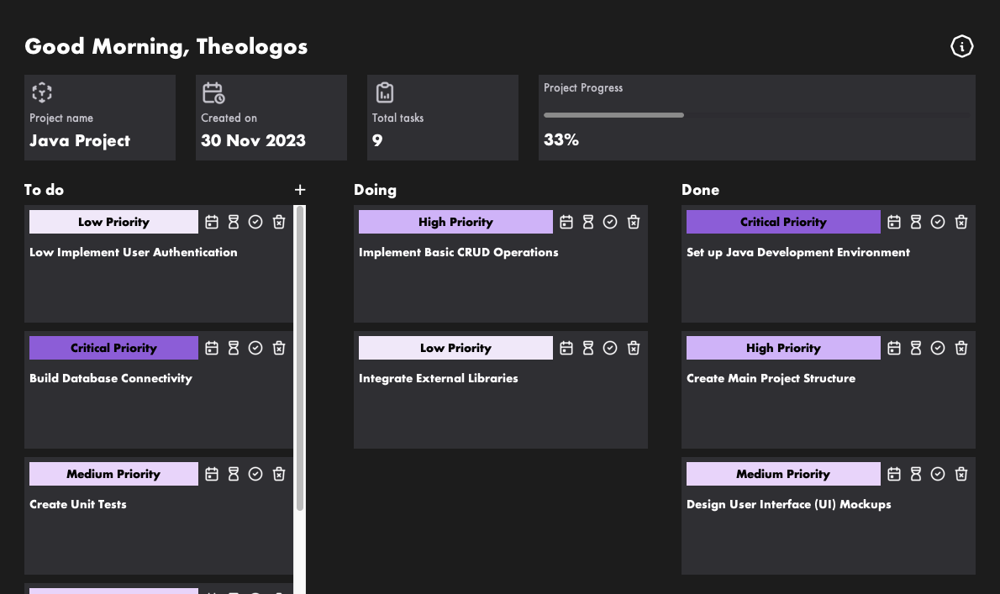

# 📋 Taaasks

## Unleash the Power of Organization

**Taaasks** is a task management tool that lets you conquer your to-dos with the simplicity and charm of a Trello-inspired interface. Crafted as a part of a university project using Java Swing, Taaasks empowers you to take control of your to-dos with style.

## How to use

Navigate your tasks with ease:

- Create tasks and organize them into Todo, Doing, or Done columns.
- Swiftly move tasks between columns to reflect your progress.
- Dive into productivity.

## About

This project was my introduction to Java, undertaken as part of a university class assignment. Taaasks is a task management tool developed using Java Swing.

